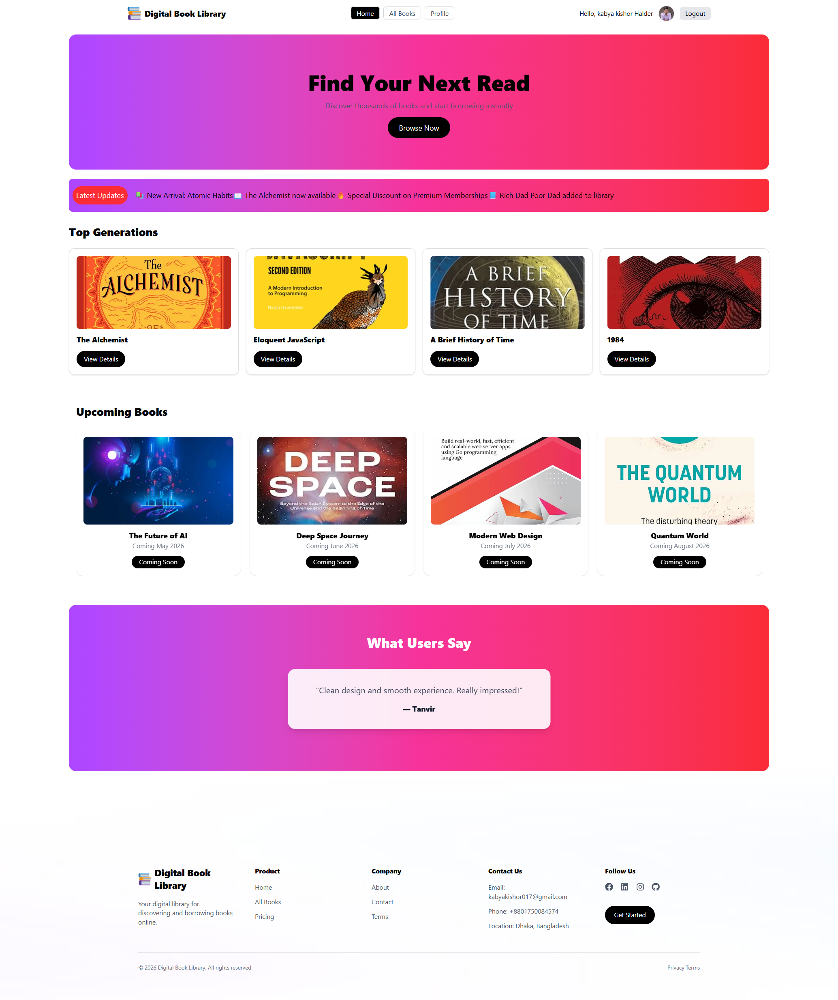
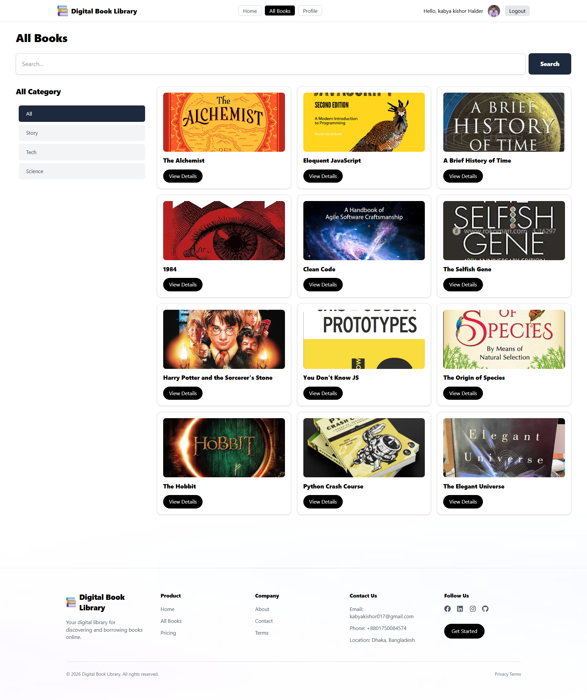
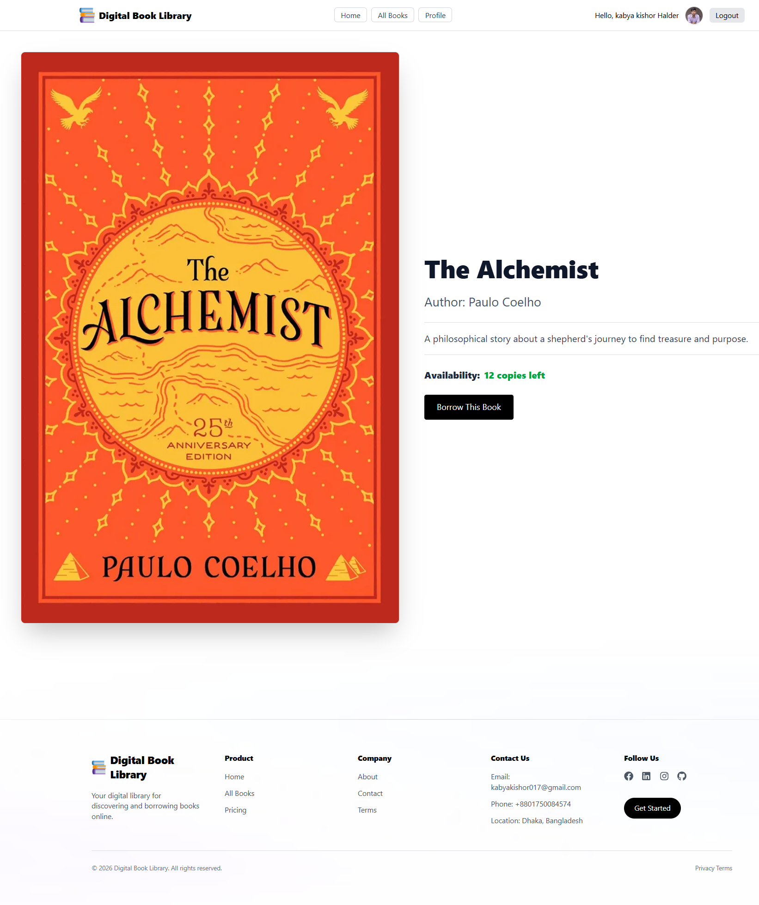
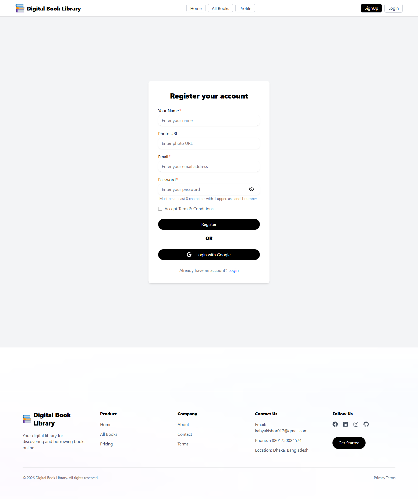
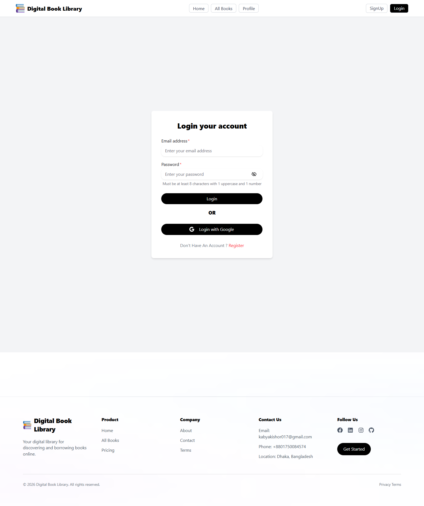
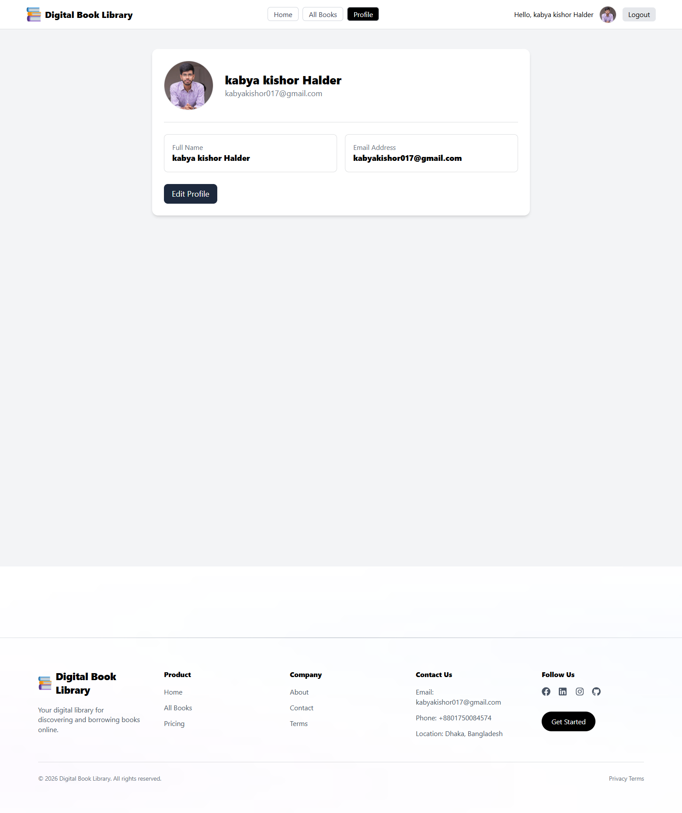

# 📚 Digital Book Library

## 📖 Project Purpose

Digital Book Library is a full-stack web application where users can explore, search, and borrow books online.
It includes an authentication system and protected routes so that only logged-in users can access certain features.

---

## 🌐 Live URL

👉 https://your-project-link.vercel.app

## 🐙 GitHub URL:

👉 https://github.com/Kabya55

---

## 🖼️ Screenshots

### 🏠 Home Page



### 📚 All Books Page



### 📖 Book Details Page



### 🔐 Signup Page



### 🔐 Login Page



### 👤 Profile Page



---

## ✨ Key Features

- 🔐 User Authentication (Login & Register)
- 📚 Browse All Books
- 🔍 Search books by title
- 🗂️ Category filter (Story, Tech, Science)
- 📖 Book Details Page (Private Route)
- 👤 User Profile Page (Private Route)
- ✏️ Update Profile (Name & Image)
- 🎞️ Swiper Slider (Testimonials)
- 📢 Marquee for latest updates
- 🖼️ Avatar fallback (initials if no image)
- 🚫 Protected Routes using Middleware

---

## 📦 NPM Packages Used

- **next** – React framework
- **react** – UI library
- **tailwindcss** – Styling
- **@heroui/react** – UI components
- **better-auth** – Authentication system
- **mongodb** – Database
- **react-toastify** – Toast notifications
- **swiper** – Slider
- **react-fast-marquee** – Marquee animation

---

## ⚙️ Setup & Run

```bash
npm install
npm run dev
```

---

## 🔑 Environment Variables

Create a `.env.local` file:

```env
BETTER_AUTH_SECRET=your_better_auth_secret
BETTER_AUTH_URL=http://localhost:3000
NEXT_PUBLIC_BETTER_AUTH_URL=http://localhost:3000
MONGODB_URI=your_mongodb_uri
GOOGLE_CLIENT_ID=your_google_client_id
GOOGLE_CLIENT_SECRET=your_google_client_secret
```

---

## 👨‍💻 Author

**Kabya Kishore Halder**

- LinkedIn: https://www.linkedin.com/in/kabya-kishor-halder/
- Facebook: https://www.facebook.com/kabya55

---

## 📄 License

This project is for educational purposes.
